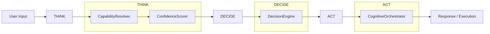
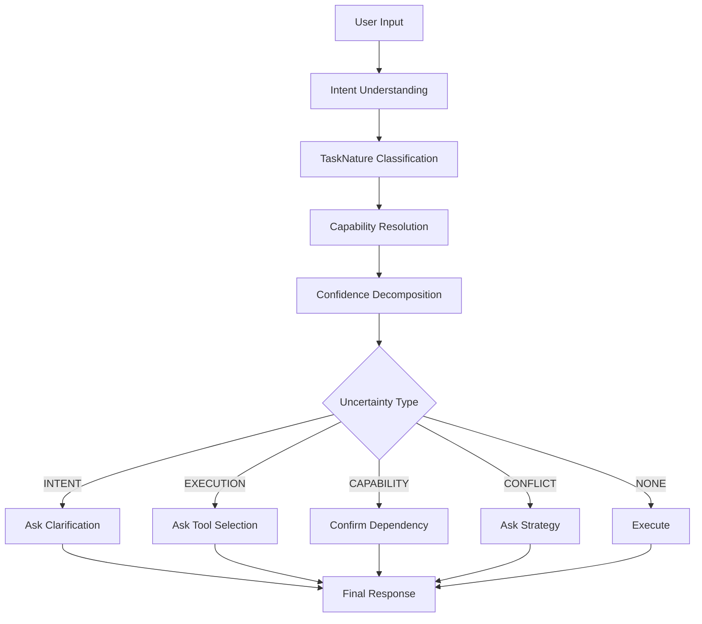
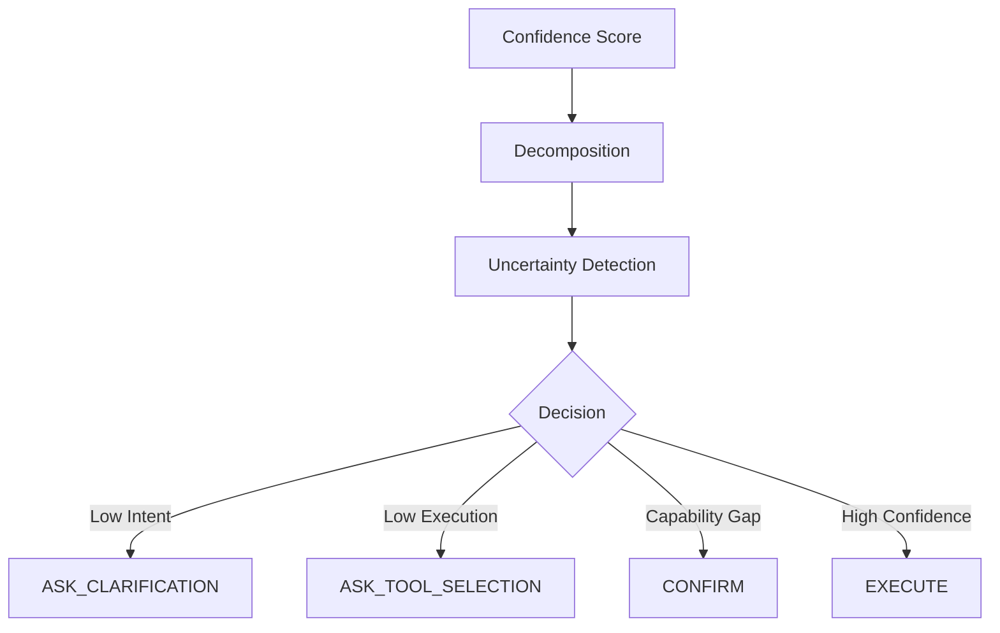
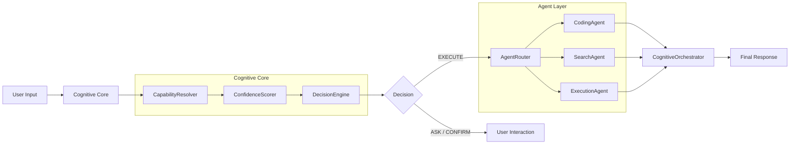
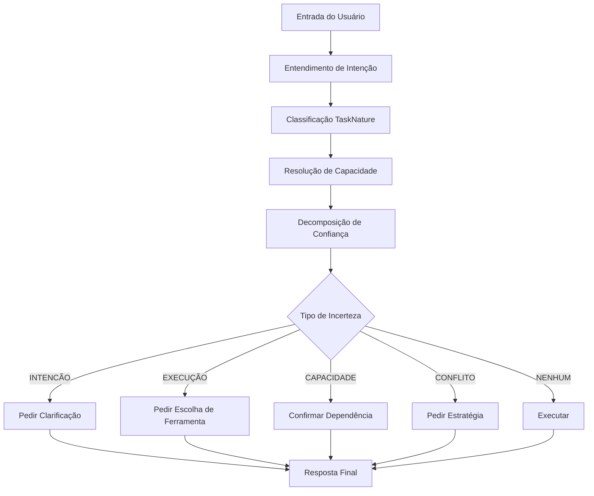
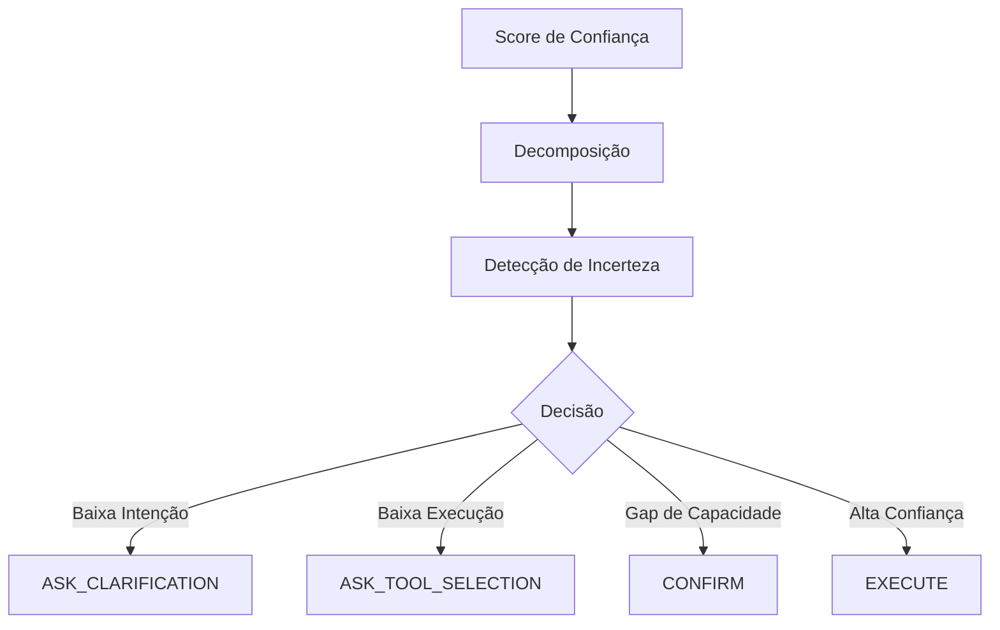
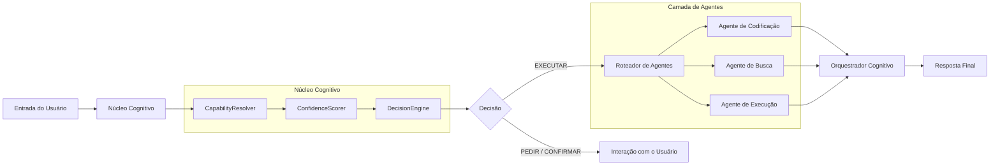

[🇧🇷 Ver versão em Português](#-versão-em-português)

# IalClaw Cognitive System v3.1
### Adaptive cognitive agent that doesn't just respond — it evaluates its own capabilities, measures its uncertainty, and decides how to act.

<p align="center">
  
</p>

 

IalClaw is an **Adaptive Cognitive Agent** (100% local and private) developed in Node.js (TypeScript). 

IalClaw is an original system, designed from scratch based on its own cognitive architecture. While inspired by ideas present in projects like OpenClaw, it does not use code or structure from those projects, being an independent implementation.

---

## 🧠 Architecture Origin

IalClaw was designed from the ground up based on its own specifications (design and architecture files).

The system was inspired by concepts explored in the autonomous agent community, including projects like OpenClaw, but it does not reuse code or the structure of those projects.

---

---

# ⚠️ **Status: v3.1 Stabilization**

This project implements a complete cognitive architecture. While functional, it is undergoing behavior validation for its autonomy engine.

---

## 🧠 Cognitive Architecture v3.1 (Fundamental Layers)

### 🧭 Cognitive Pipeline (THINK → DECIDE → ACT)



```md
THINK  → CapabilityResolver + ConfidenceScorer
DECIDE → DecisionEngine
ACT    → CognitiveOrchestrator
```

## 🔗 Integrated Cognitive Flow

### 🔍 Cognitive Decision Flow



The system follows the flow:
**Input → Intent → TaskNature → Capability → Confidence → Decision → Action**

This ensures consistent, explainable, and adaptive decisions.

## 🧩 Task Nature (TaskNature)

The system automatically classifies the task as:
- **Informative** → direct response via LLM.
- **Executable** → requires tools or actions.
- **Hybrid** → combines response + optional execution.

## 🚀 Differential

Unlike traditional agents that use only a confidence score, IalClaw uses cognitive diagnostics to understand the root of uncertainty and act in a contextual and secure manner.

### 1. Unified Cognitive Pipeline (THINK → DECIDE → ACT)
The system operates through a structured cognitive loop that ensures consistent and explainable behavior:
- **THINK (`CapabilityResolver`)**: Evaluates the user task against the system's available tools. It detects "Capability Gaps" (blocking vs enhancement) and proposes self-healing solutions.
- **DECIDE (`DecisionEngine`)**: Weighs risk, confidence, and intent to select the safest and most efficient path (EXECUTE, ASK, or CONFIRM).
- **ACT (`CognitiveOrchestrator`)**: Executes the chosen strategy (Direct LLM, Tool Loop, or Hybrid) with full traceability.

### 2. Capability Awareness & Self-Healing
IalClaw is aware of what it can and cannot do:
- **Gap Detection**: Automatically identifies missing dependencies (e.g., FFmpeg for video, Git for VCS).
- **Capability Resolution**: The agent doesn't just detect limitations; it proposes and executes strategies to overcome them (**self-healing**).
- **Anti-Regression Rules**: Prevents unnecessary tool or environment checks for purely informative/conversational tasks.

### 3. Cognitive Diagnostics & Uncertainty Model
IalClaw doesn't just use a simple confidence score (0–1). It implements a **Cognitive Diagnostic Model** based on uncertainty types.

#### 🧩 Uncertainty Types
The system classifies uncertainty into specific categories:
- **INTENT** → Did not clearly understand the user's request.
- **EXECUTION** → Understood the request but doesn't know how to execute it.
- **KNOWLEDGE** → Lacks enough information in memory or context.
- **CAPABILITY** → Knows how to execute but a necessary tool is missing (**Capability Gap**).
- **CONFLICT** → High confidence in intent but low in execution (or vice-versa).
- **NONE** → Total confidence.

#### ⚖️ Confidence Decomposition
Confidence is dynamically weighted based on the nature of the task:
| Task Nature | Intent Weight | Execution Weight |
|---|---|---|
| **Informative** | 70% | 30% |
| **Executable** | 30% | 70% |

#### 🚦 Decision Mapping
Each uncertainty type leads to a specific action:
- **INTENT** → `ASK_CLARIFICATION`
- **EXECUTION** → `ASK_TOOL_SELECTION`
- **CONFLICT** → `ASK_EXECUTION_STRATEGY`
- **CAPABILITY** → `CONFIRM` (installation or dependency resolution)
- **NONE + High confidence** → `EXECUTE`

### 📊 Decision Matrix (DecisionEngine)

> This matrix represents how cognitive diagnostics translate into actionable decisions.



#### 🧠 Cognitive Behavior
This model allows the agent to:
- Understand **why** it is in doubt.
- Choose the best way to interact with the user.
- Avoid incorrect actions with partial confidence.
- Explain its decisions transparently.

## 🔍 From Confidence to Cognitive Diagnostics
Traditionally, agents use a single confidence score. IalClaw evolves this concept into a diagnostic model:
**Confidence → Decomposition → Uncertainty → Decision**
This transforms the agent from reactive to reflective and explainable.

---

## 🤖 Multi-Agent Orchestration (Planned Architecture)

### 🧩 Multi-Agent Architecture



---

## 🏗️ Cognitive Infrastructure and Execution (Base Components)

- **Graph-RAG & Hybrid Memory**: Cognitive Nodes with vector embeddings (Ollama + SQLite) merged with Graph Score.
- **Memory Consolidation ("Dreaming")**: `MemoryDreamer` prunes irrelevant episodic memories and decays the graph to optimize retrieval.
- **Persistent Execution Memory**: `DecisionMemory` stores historical tool performance to improve future decisions.
- **Workspace Service**: Structured project management (`/workspace`) for safe artifact handling.
- **Web Dashboard & Telemetry**: Real-time neural graph visualization and thought-process tracing (`http://localhost:3000`).
- **Extensible Skills**: Native integration with Web Search, File System, and more.


---

## 🛠️ Built With

- **Node.js & TypeScript** - Core engine
- **Ollama** - Local LLM & Embeddings
- **SQLite** - Vector & Relational Storage
- **Telegram Bot API** - Primary Interface
- **SSE/WebSocket** - Real-time Telemetry
- **OpenClaw** - Conceptual reference (not used as code base)

---

## 🚀 One-Line Quick Install

### Linux / macOS
```bash
curl -fsSL https://raw.githubusercontent.com/rovanni/IalClaw/main/install.sh | bash
```

### Windows (PowerShell)
```powershell
irm https://raw.githubusercontent.com/rovanni/IalClaw/main/install.ps1 | iex
```

---

## 💻 Manual Installation / Execution

1. **Prerequisites**: 
   - **Node.js (>= 18)**
   - **Ollama** (installed and running)
   - Recommended model: `qwen2.5:7b` (or your preferred model via config)

2. **Clone & Install**:
```bash
git clone https://github.com/rovanni/IalClaw.git
cd IalClaw
npm install
```

3. **Interactive Environment Setup**:
```bash
npm run setup
```
> 💡 **TIP:** The setup wizard will guide you step-by-step. Keep handy:
> - Your **Bot Token** (create it by talking to [@BotFather](https://t.me/botfather) on Telegram).
> - Your **Telegram User ID** (find it by sending a \"Hi\" to [@userinfobot](https://t.me/userinfobot)).

4. **Start the Cognitive Agent**:

IalClaw ships with a built-in CLI (`bin/ialclaw.js`). You can run it directly or through npm scripts:

```bash
# Foreground (development)
node bin/ialclaw.js start

# Background (VPS / production)
node bin/ialclaw.js start --daemon

# Debug mode (verbose logging)
node bin/ialclaw.js start --debug

# Debug + live log tail in the same terminal
node bin/ialclaw.js start --debug --tail
```

The npm scripts still work as shortcuts:
```bash
npm run dev              # same as: node bin/ialclaw.js start
npm run dev:debug        # same as: node bin/ialclaw.js start --debug
npm run dev:debug:tail   # same as: node bin/ialclaw.js start --debug --tail
```

> **VPS tip:** Use `--daemon` to detach the agent from your SSH session. The process keeps running after you disconnect.

5. **Manage the Agent**:

```bash
node bin/ialclaw.js status           # check if running (shows PID, uptime, mode)
node bin/ialclaw.js stop             # gracefully stop the agent
node bin/ialclaw.js restart          # stop + start (preserves flags)
node bin/ialclaw.js logs             # show last 30 log lines
node bin/ialclaw.js logs --follow    # tail logs in real time (cross-platform)
```

> You can also install the CLI globally with `npm link` from the project root, then use `ialclaw start`, `ialclaw status`, etc. from anywhere.

---

## 🐧 Auto-Startup (Linux / systemd)

To make IalClaw start automatically on boot:

1.  **Run Setup Script**:
    ```bash
    sudo bash scripts/setup-service.sh
    ```
2.  **Check Status**: `systemctl status ialclaw`
3.  **Check Logs**: `journalctl -u ialclaw -f`

---

## 🐙 CLI Reference

| Command | Description |
|---|---|
| `node bin/ialclaw start` | Start in foreground (dev) |
| `node bin/ialclaw start --daemon` | Start in background (VPS/production) |
| `node bin/ialclaw start --debug` | Start with `LOG_LEVEL=debug` |
| `node bin/ialclaw start --debug --tail` | Debug + live log stream |
| `node bin/ialclaw stop` | Stop the running agent |
| `node bin/ialclaw restart` | Restart (stop + start) |
| `node bin/ialclaw status` | Show PID, uptime, mode, daemon status |
| `node bin/ialclaw logs` | Print last 30 log lines |
| `node bin/ialclaw logs --follow` | Tail logs in real time |
| `node bin/ialclaw lang` | Show current language and configured language |
| `node bin/ialclaw lang pt-BR` | Persist language to `config.json` |
| `node bin/ialclaw help` | Show all commands |

You can override the language for a single command with:
- `node bin/ialclaw status --lang=en-US`
- `node bin/ialclaw start --lang=pt-BR`

Internal features:
- **Lock file** — prevents two simultaneous starts (race condition protection)
- **PID management** — stale PID detection and cleanup (`.ialclaw/pid`)
- **Log rotation** — auto-rotates `ialclaw.log` when it exceeds 5 MB
- **Cross-platform** — works on Linux, macOS, and Windows

---

## 🌐 Internationalization (i18n)

The system now has unified language behavior across CLI, backend, and web dashboard:

- Resolution priority: `--lang` (CLI) → `APP_LANG` (`.env`) → `config.json` → `en-US`
- During installation, you can select `pt-BR` or `en-US` - it's saved to `.env`
- To change later: edit `.env` and set `APP_LANG=pt-BR` or `APP_LANG=en-US`
- Persistent language command: `ialclaw lang <pt-BR|en-US>` (saves to `config.json`)
- CLI output fully translated with `t(...)`
- Backend startup language resolved from the same source of truth
- Dashboard (`/advanced` and `/simple`) integrated with frontend i18n and runtime language loading

---

## 🔍 Semantic Search System

IalClaw includes a **hybrid semantic search system** that combines intelligent indexing with Graph-RAG expansion.

### Features

- **Inverted Index**: Fast term-based search
- **Smart Tokenization**: With normalization and stopwords
- **Auto-tagging**: Generates semantic structure using LLM (tokens, keywords, tags, category, relations)
- **Graph Integration**: Expands queries via cognitive graph relations
- **Hybrid Scoring**: Combines token, tag, and graph relation matches
- **LLM Re-ranking**: Optional re-ranking of top results
- **Synonym Expansion**: Local synonym expansion for better results
- **Debug Mode**: Detailed score breakdowns and expansion info

> For technical specification, see [specs/search-system.md](./specs/search-system.md).

---

## 🧩 Skills System

IalClaw extends its capabilities through **Skills** — self-contained instruction packages that are resolved **before** the LLM is invoked.

### Directory Layout

```
skills/
  internal/          ← Trusted skills (no audit required)
    skill-auditor/   ← Security auditor for public skills
    skill-installer/ ← Marketplace search & install
  public/            ← Third-party skills (audit required)
  quarantine/        ← Blocked skills (never loaded)
```

### How It Works

1. **SkillLoader** scans `skills/` at boot, parses each `SKILL.md` frontmatter and loads triggers from `skill.json`
2. **SkillResolver** matches every user message against loaded skills using three strategies (in priority order):
   - Slash command: `/skill-name [args]`
   - Name mention in text
   - FreeText triggers (from `skill.json → invocation.freeText`)
3. If a skill matches, its body is injected as the system prompt via `runWithSkill()`
4. If no skill matches, the agent still lists all installed skills in the LLM context (skill awareness)

### Built-in Skills

| Skill | Invocation | Purpose |
|---|---|---|
| **skill-auditor** | `/skill-auditor <name>` | Analyzes public skill files for security risks |
| **skill-installer** | `/install-skill <topic>`, `/find-skill <topic>` | Searches the marketplace and installs new skills |

### Installing a Public Skill

1. Copy the skill folder to `skills/public/<name>/`
2. Run `/skill-auditor <name>` in Telegram to audit
3. If approved, the skill is loaded on next boot or hot-reload

> For the full technical specification, see [specs/skills-system.md](./specs/skills-system.md).

---

## 📋 Environment & Observability

Main environment variables:
- `APP_LANG=pt-BR|en-US` - System language (also set during installation)
- `LOG_LEVEL=debug|info|warn|error`
- `LOG_DIR=logs`
- `LOG_CONSOLE_FORMAT=pretty|json`
- `SAFE_MODE=true|false` to force direct replies and bypass planner/executor orchestration while stabilizing the agent

The agent writes JSON line logs to files with `trace_id`, component, event, duration, and normalized errors. For humans reading the terminal, the default console output is `pretty`, with a cognitive summary style such as `[START]`, `[DECISION]`, `[EXECUTION]`, and `[RESULT]`. Use `LOG_CONSOLE_FORMAT=json` if you need raw JSON on stdout/stderr.

When `SAFE_MODE=true` (default), the agent prioritizes a direct response path so it keeps answering even if the planning pipeline is unstable. Set `SAFE_MODE=false` to re-enable the full planner-driven execution flow.

## Troubleshooting

### Missing Telegram Token
Symptoms:
- Startup stops immediately
- Log event `missing_telegram_token`

Fix:
- create or update `.env`
- set `TELEGRAM_BOT_TOKEN` with the token generated by BotFather

### Ollama Unreachable
Symptoms:
- replies mention communication failure with Ollama
- logs contain `ollama_unreachable` or `fetch failed`

Fix:
- confirm Ollama is running
- verify `OLLAMA_HOST`
- test the endpoint manually before starting the agent

### Model Not Found
Symptoms:
- response says the configured model was not found
- logs contain `ollama_model_not_found`

Fix:
- check `OLLAMA_MODEL` or `MODEL`
- pull the model locally before running the agent

### Telegram User Not Allowed
Symptoms:
- the bot appears online but ignores messages
- logs contain `unauthorized_user`

Fix:
- add your numeric Telegram user id to `TELEGRAM_ALLOWED_USER_IDS`
- if using multiple users, separate ids with commas

---

## 🔄 How to Update

If you already have IalClaw installed, use the included updater scripts:
- **Windows:** Double-click `update.bat`
- **Linux/macOS:** Run `bash update.sh`

Beginner-friendly Linux/macOS update steps:
1. Open a terminal.
2. Go to the folder where IalClaw is installed.
3. Run the updater from inside that folder.

Example:
```bash
cd ~/ialclaw
bash update.sh
```

If you installed the project in another location, replace `~/ialclaw` with the correct folder path.

---

## 🗺️ Roadmap v3.x
- [ ] Advanced Tool-Use integration (Browsing, Python Sandbox)
- [ ] Multi-modal support (Vision/Voice)
- [ ] Enhanced Graph Visualization with D3.js
- [ ] Long-term memory backup/export
- [ ] Integrated Workspace UI in the Dashboard

---

## 📄 Documentation
For detailed technical specifications and cognitive architecture notes, see the [/specs](./specs) folder.

---

## 🤝 Contributing
Contributions are welcome! Feel free to open an **issue** to discuss new ideas or report bugs. If you want to contribute code, please open a **Pull Request**.

---
---

# 🇧🇷 Versão em Português

# IalClaw Cognitive System v3.1
### Agente cognitivo adaptativo que não apenas responde — ele avalia suas próprias capacidades, mede sua incerteza e decide como agir.

<p align="center">
  
</p>

 

O IalClaw é um **Agente Cognitivo Adaptativo** (100% local e privado), desenvolvido em Node.js (TypeScript). 

O IalClaw é um sistema original, projetado do zero com base em uma arquitetura cognitiva própria. Embora inspirado por ideias presentes em projetos como OpenClaw, não utiliza código ou estrutura desses projetos, sendo uma implementação independente.

---

## 🧠 Origem da Arquitetura

O IalClaw foi projetado do zero a partir de especificações próprias (arquivos de design e arquitetura).

O sistema foi inspirado por conceitos explorados na comunidade de agentes autônomos, incluindo projetos como OpenClaw, mas não reutiliza código nem estrutura desses projetos.

---

# ⚠️ **Status: Estabilização v3.1**

Este projeto implementa uma arquitetura cognitiva completa. Embora funcional, está em fase de validação de comportamento para seu motor de autonomia.

---

## 🧠 Arquitetura Cognitiva v3.1 (Camadas Fundamentais)

### 🧭 Pipeline Cognitivo (THINK → DECIDE → ACT)


```md
THINK  → CapabilityResolver + ConfidenceScorer  
DECIDE → DecisionEngine  
ACT    → CognitiveOrchestrator
```

## 🔗 Fluxo Cognitivo Integrado

### 🔍 Fluxo de Decisão Cognitiva



O sistema segue o fluxo:
**Input → Intent → TaskNature → Capability → Confidence → Decision → Action**

Isso garante decisões consistentes, explicáveis e adaptativas.

## 🧩 Natureza da Tarefa (TaskNature)

O sistema classifica automaticamente a tarefa como:
- **Informativa** → resposta direta via LLM.
- **Executável** → requer ferramentas ou ações.
- **Híbrida** → combina resposta + execução opcional.

## 🚀 Diferencial

Diferente de agentes tradicionais que usam apenas um score de confiança, o IalClaw utiliza diagnóstico cognitivo para entender a origem da incerteza e agir de forma contextual e segura.

### 1. Pipeline Cognitivo Unificado (THINK → DECIDE → ACT)
O sistema opera através de um ciclo cognitivo estruturado que garante comportamento consistente e explicável:
- **THINK (`CapabilityResolver`)**: Avalia a tarefa do usuário em relação às ferramentas disponíveis. Detecta "Lacunas de Capacidade" (bloqueantes vs melhorias) e propõe soluções de autorrecuperação (self-healing).
- **DECIDE (`DecisionEngine`)**: Pesa risco, confiança e intenção para selecionar o caminho mais seguro e eficiente (EXECUTE, ASK ou CONFIRM).
- **ACT (`CognitiveOrchestrator`)**: Executa a estratégia escolhida (LLM Direto, Loop de Ferramentas ou Híbrido) com total rastreabilidade.

### 2. Consciência de Capacidade (Self-Healing)
O IalClaw tem consciência do que pode e não pode fazer:
- **Detecção de Lacunas**: Identifica automaticamente dependências ausentes (ex: FFmpeg para vídeo, Git para VCS).
- **Resolução de Capacidade**: O agente não apenas detecta limitações, mas propõe e executa estratégias para superá-las (**self-healing**).
- **Regras Anti-Regressão**: Evita verificações desnecessárias de ferramentas ou ambiente para tarefas puramente informativas ou de conversação.

### 3. Diagnóstico Cognitivo & Modelo de Incerteza
O IalClaw não utiliza apenas um score de confiança (0–1). Ele implementa um modelo de diagnóstico cognitivo baseado em tipos de incerteza.

#### 🧩 Tipos de Incerteza (Uncertainty Types)
O sistema classifica a incerteza em categorias específicas:
- **INTENT** → não entendeu claramente o pedido do usuário
- **EXECUTION** → entendeu o pedido, mas não sabe como executar
- **KNOWLEDGE** → falta informação suficiente na memória ou contexto
- **CAPABILITY** → sabe como executar, mas falta ferramenta (**Capability Gap**)
- **CONFLICT** → alta confiança na intenção, mas baixa na execução (ou vice-versa)
- **NONE** → confiança total

#### ⚖️ Confiança Decomposta (Confidence Decomposition)
A confiança é ponderada dinamicamente com base na natureza da tarefa:
| Natureza da Tarefa | Peso Intenção | Peso Execução |
| :--- | :--- | :--- |
| **Informativa** | 70% | 30% |
| **Executável** | 30% | 70% |

#### 🚦 Mapeamento de Decisão (Decision Mapping)
Cada tipo de incerteza leva a uma ação específica:
- **INTENT** → `ASK_CLARIFICATION`
- **EXECUTION** → `ASK_TOOL_SELECTION`
- **CONFLICT** → `ASK_EXECUTION_STRATEGY`
- **CAPABILITY** → `CONFIRM` (instalação ou resolução de dependência)
- **NONE + Alta confiança** → `EXECUTE`

### 📊 Matriz de Decisão (DecisionEngine)

> Esta matriz representa como diagnósticos cognitivos se traduzem em decisões acionáveis.



#### 🧠 Comportamento Cognitivo
Esse modelo permite que o agente:
- entenda **por que** está em dúvida
- escolha a melhor forma de interagir com o usuário
- evite ações incorretas com confiança parcial
- explique suas decisões de forma transparente

## 🔍 De Confiança para Diagnóstico Cognitivo
Tradicionalmente, agentes utilizam um único score de confiança. O IalClaw evolui esse conceito para um modelo diagnóstico:
**Confidence → Decomposition → Uncertainty → Decision**
Isso transforma o agente de reativo para reflexivo e explicável.

---

## 🤖 Orquestração Multi-Agente (Arquitetura Planejada)

### 🧩 Arquitetura Multi-Agente



---

## 🏗️ Infraestrutura Cognitiva e Execução (Componentes Base)

- **Graph-RAG & Memória Híbrida**: Nós cognitivos com embeddings vetoriais (Ollama + SQLite) mesclados com Graph Score.
- **Consolidação de Memória ("Sonho")**: `MemoryDreamer` poda memórias episódicas irrelevantes e decai o grafo para otimizar a recuperação.
- **Memória de Execução Persistente**: `DecisionMemory` armazena o desempenho histórico de ferramentas para melhorar decisões futuras.
- **Serviço de Workspace**: Gerenciamento estruturado de projetos (`/workspace`) para manipulação segura de artefatos.
- **Dashboard Web & Telemetria**: Visualização de grafos neurais e rastreamento do processo de pensamento em tempo real (`http://localhost:3000`).
- **Habilidades Extensíveis**: Integração nativa com Busca Web, Sistema de Arquivos e muito mais.


---

## 🛠️ Tecnologias Utilizadas

- **Node.js & TypeScript** - Motor principal
- **Ollama** - LLM Local & Embeddings
- **SQLite** - Armazenamento Vetorial e Relacional
- **Telegram Bot API** - Interface Principal
- **SSE/WebSocket** - Telemetria em Tempo Real
- **OpenClaw** - Referência conceitual (não utilizado como base de código)

---

## 🚀 Instalação Rápida com 1 Linha

### Linux / macOS
```bash
curl -fsSL https://raw.githubusercontent.com/rovanni/IalClaw/main/install.sh | bash
```

### Windows (PowerShell)
```powershell
irm https://raw.githubusercontent.com/rovanni/IalClaw/main/install.ps1 | iex
```

---

## 💻 Instalação / Execução Manual

1. **Pré-requisitos**:
   - **Node.js (>= 18)**
   - **Ollama** (instalado e rodando)
   - Modelo recomendado: `qwen2.5:7b` (ou seu modelo de preferência via config)

2. **Clone & Instale**:
```bash
git clone https://github.com/rovanni/IalClaw.git
cd IalClaw
npm install
```

3. **Configure o ambiente interativamente**:
```bash
npm run setup
```

4. **Inicie o Agente Cognitivo**:

O IalClaw inclui uma CLI própria (`bin/ialclaw.js`). Rode diretamente ou via npm scripts:

```bash
# Foreground (desenvolvimento)
node bin/ialclaw.js start

# Background (VPS / produção)
node bin/ialclaw.js start --daemon

# Modo debug (log detalhado)
node bin/ialclaw.js start --debug

# Debug + tail de log em tempo real no mesmo terminal
node bin/ialclaw.js start --debug --tail
```

Os npm scripts continuam funcionando como atalhos:
```bash
npm run dev              # equivale a: node bin/ialclaw.js start
npm run dev:debug        # equivale a: node bin/ialclaw.js start --debug
npm run dev:debug:tail   # equivale a: node bin/ialclaw.js start --debug --tail
```

> **Dica VPS:** Use `--daemon` para desacoplar o agente da sessão SSH. O processo continua rodando após desconectar.

5. **Gerencie o Agente**:

```bash
node bin/ialclaw.js status           # verifica status (PID, uptime, modo)
node bin/ialclaw.js stop             # encerra o agente graciosamente
node bin/ialclaw.js restart          # stop + start (preserva flags)
node bin/ialclaw.js logs             # exibe últimas 30 linhas do log
node bin/ialclaw.js logs --follow    # acompanha log em tempo real (cross-platform)
```

> Você também pode instalar a CLI globalmente com `npm link` na raiz do projeto e usar `ialclaw start`, `ialclaw status`, etc. de qualquer lugar.

---

## 🐧 Inicialização Automática (Linux / systemd)

Para fazer o IalClaw iniciar automaticamente no boot:

1.  **Rodar Script de Configuração**:
    ```bash
    sudo bash scripts/setup-service.sh
    ```
2.  **Verificar Status**: `systemctl status ialclaw`
3.  **Acompanhar Logs**: `journalctl -u ialclaw -f`

---

## 🐙 Referência da CLI

| Comando | Descrição |
|---|---|
| `node bin/ialclaw start` | Inicia em foreground (dev) |
| `node bin/ialclaw start --daemon` | Inicia em background (VPS/produção) |
| `node bin/ialclaw start --debug` | Inicia com `LOG_LEVEL=debug` |
| `node bin/ialclaw start --debug --tail` | Debug + stream de log ao vivo |
| `node bin/ialclaw stop` | Encerra o agente |
| `node bin/ialclaw restart` | Reinicia (stop + start) |
| `node bin/ialclaw status` | Mostra PID, uptime, modo, daemon |
| `node bin/ialclaw logs` | Últimas 30 linhas do log |
| `node bin/ialclaw logs --follow` | Tail do log em tempo real |
| `node bin/ialclaw lang` | Mostra idioma atual e idioma configurado |
| `node bin/ialclaw lang pt-BR` | Persiste idioma no `config.json` |
| `node bin/ialclaw help` | Exibe todos os comandos |

Você pode sobrescrever o idioma em um único comando com:
- `node bin/ialclaw status --lang=en-US`
- `node bin/ialclaw start --lang=pt-BR`

Recursos internos:
- **Lock file** — impede dois starts simultâneos (proteção contra race condition)
- **Gerenciamento de PID** — detecção e limpeza de PID stale (`.ialclaw/pid`)
- **Rotação de logs** — rotaciona `ialclaw.log` automaticamente ao ultrapassar 5 MB
- **Cross-platform** — funciona em Linux, macOS e Windows

---

## 🌐 Internacionalização (i18n)

O sistema agora possui comportamento unificado de idioma entre CLI, backend e dashboard web:

- Prioridade de resolução: `--lang` (CLI) → `APP_LANG` (`.env`) → `config.json` → `en-US`
- Durante a instalação, você pode selecionar `pt-BR` ou `en-US` - salvo no `.env`
- Para alterar depois: edite o `.env` e defina `APP_LANG=pt-BR` ou `APP_LANG=en-US`
- Comando de idioma persistente: `ialclaw lang <pt-BR|en-US>` (salva no `config.json`)
- Saída da CLI totalmente traduzida com `t(...)`
- Idioma de inicialização do backend resolvido pela mesma fonte de verdade
- Dashboard (`/advanced` e `/simple`) integrado com i18n no frontend e carregamento dinâmico de idioma

---

## 🔍 Sistema de Busca Semântica

O IalClaw inclui um **sistema de busca semântica híbrido** que combina indexação inteligente com expansão via Graph-RAG.

### Funcionalidades

- **Índice Invertido**: Busca rápida por termos
- **Tokenização Inteligente**: Com normalização e stopwords
- **Auto-tagging**: Gera estrutura semântica usando LLM (tokens, keywords, tags, categoria, relações)
- **Integração com Grafo**: Expande queries via relações do grafo cognitivo
- **Pontuação Híbrida**: Combina matches de tokens, tags e relações do grafo
- **Re-ranking LLM**: Opcional, re-ordena top resultados
- **Expansão de Sinônimos**: Expansão local de sinônimos para melhores resultados
- **Modo Debug**: Detalhamento de scores e expansão

> Para especificação técnica, veja [specs/search-system.md](./specs/search-system.md).

---

## 🧩 Sistema de Skills

O IalClaw estende suas capacidades através de **Skills** — pacotes de instrução autocontidos que são resolvidos **antes** da chamada ao LLM.

### Layout de Diretórios

```
skills/
  internal/          ← Skills confiáveis (sem auditoria)
    skill-auditor/   ← Auditor de segurança para skills públicas
    skill-installer/ ← Busca e instalação do marketplace
  public/            ← Skills de terceiros (auditoria obrigatória)
  quarantine/        ← Skills bloqueadas (nunca carregadas)
```

### Como Funciona

1. **SkillLoader** varre `skills/` no boot, parseia o frontmatter de cada `SKILL.md` e carrega triggers do `skill.json`
2. **SkillResolver** compara cada mensagem do usuário com as skills carregadas usando três estratégias (em ordem de prioridade):
   - Slash command: `/nome-da-skill [args]`
   - Menção ao nome da skill no texto
   - Triggers freeText (de `skill.json → invocation.freeText`)
3. Se uma skill casar, seu corpo é injetado como system prompt via `runWithSkill()`
4. Se nenhuma skill casar, o agente ainda lista todas as skills instaladas no contexto do LLM (consciência de skills)

### Skills Nativas

| Skill | Invocação | Propósito |
|---|---|---|
| **skill-auditor** | `/skill-auditor <nome>` | Analisa arquivos de skills públicas em busca de riscos de segurança |
| **skill-installer** | `/install-skill <tema>`, `/find-skill <tema>` | Busca no marketplace e instala novas skills |

### Instalando uma Skill Pública

1. Copie a pasta da skill para `skills/public/<nome>/`
2. Execute `/skill-auditor <nome>` no Telegram para auditar
3. Se aprovada, a skill será carregada no próximo boot ou hot-reload

> Para a especificação técnica completa, veja [specs/skills-system.md](./specs/skills-system.md).

---

## 📋 Ambiente & Observabilidade

Principais variáveis de ambiente:
- `APP_LANG=pt-BR|en-US` - Idioma do sistema (também definido durante a instalação)
- `LOG_LEVEL=debug|info|warn|error`
- `LOG_DIR=logs`
- `LOG_CONSOLE_FORMAT=pretty|json`
- `SAFE_MODE=true|false` para forçar respostas diretas e pular a orquestração planner/executor

O agente grava logs em JSON Lines com `trace_id`, componente, evento, duração e erro normalizado. No terminal, o formato padrão é `pretty`, com estilo cognitivo (`[START]`, `[DECISION]`, `[EXECUTION]`, `[RESULT]`). Use `LOG_CONSOLE_FORMAT=json` para JSON puro no stdout/stderr.

Quando `SAFE_MODE=true` (padrão), o agente prioriza resposta direta para continuar respondendo mesmo se o pipeline de planejamento estiver instável. Use `SAFE_MODE=false` para habilitar o fluxo completo via planner.

## Solução de Problemas

### Token do Telegram ausente
Sintomas:
- a inicialização para imediatamente
- o log mostra o evento `missing_telegram_token`

Como corrigir:
- crie ou atualize o arquivo `.env`
- defina `TELEGRAM_BOT_TOKEN` com o token gerado pelo BotFather

### Ollama inacessível
Sintomas:
- a resposta menciona falha de comunicação com o Ollama
- os logs mostram `ollama_unreachable` ou `fetch failed`

Como corrigir:
- confirme que o Ollama está em execução
- verifique `OLLAMA_HOST`
- teste manualmente o endpoint antes de iniciar o agente

### Modelo não encontrado
Sintomas:
- a resposta informa que o modelo configurado não foi encontrado
- os logs mostram `ollama_model_not_found`

Como corrigir:
- revise `OLLAMA_MODEL` ou `MODEL`
- faça o pull do modelo localmente antes de iniciar o agente

### Usuário do Telegram não autorizado
Sintomas:
- o bot parece online, mas ignora as mensagens
- os logs mostram `unauthorized_user`

Como corrigir:
- adicione seu id numérico do Telegram em `TELEGRAM_ALLOWED_USER_IDS`
- para vários usuários, separe os ids por vírgula

---

## 🔄 Como Atualizar

Se você já instalou o IalClaw, use nossos scripts de atualização:
- **Windows:** Dê um duplo-clique no arquivo `update.bat`
- **Linux/macOS:** Rode `bash update.sh` no terminal

Passo a passo para usuários iniciantes no Linux/macOS:
1. Abra o terminal.
2. Entre na pasta onde o IalClaw foi instalado.
3. Rode o atualizador de dentro dessa pasta.

Exemplo:
```bash
cd ~/ialclaw
bash update.sh
```

Se você instalou o projeto em outro local, troque `~/ialclaw` pelo caminho correto da sua pasta.

---

## 🗺️ Roadmap v3.x
- [ ] Integração avançada de ferramentas (Navegação, Python Sandbox)
- [ ] Suporte multi-modal (Visão/Voz)
- [ ] Visualização de Grafo aprimorada com D3.js
- [ ] Backup/exportação de memória de longo prazo
- [ ] Interface de Workspace integrada no Dashboard

---

## 📄 Documentação
Para especificações técnicas detalhadas e notas sobre a arquitetura cognitiva, consulte a pasta [/specs](./specs).

---

## 🤝 Contribuições
Contribuições são bem-vindas! Sinta-se à vontade para abrir uma **issue** para discutir novas ideias ou reportar bugs. Se você deseja contribuir com código, abra um **Pull Request**.
