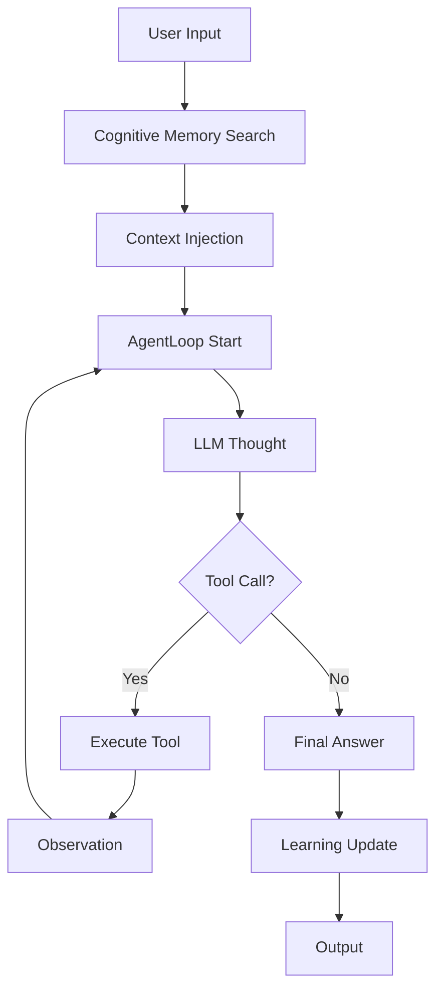

# 🧠 Spec: Agent Loop (Cognitive ReAct Engine)

**Versão:** 2.0
**Status:** Atualizado com Cognição
**Autor:** Luciano + IA
**Data:** 2026-03-23

---

# 1. Resumo

O **Agent Loop** é o motor de raciocínio do IalClaw, baseado no padrão ReAct (Reasoning and Acting).

Nesta versão, o Agent Loop evolui para um modelo **cognitivo**, onde:

* Não depende apenas de histórico
* Recebe contexto da memória cognitiva
* Aprende com cada execução

---

# 2. Contexto e Motivação

**Problema:**
Um Agent Loop tradicional depende exclusivamente de histórico de mensagens, limitando sua capacidade de raciocínio e reutilização de conhecimento.

**Solução:**
Integrar uma camada de memória cognitiva antes e depois do loop, permitindo:

* Recuperação de conhecimento relevante
* Redução de alucinação
* Aprendizado contínuo

---

# 3. Goals (Objetivos)

* [ ] G-01: Executar ciclo ReAct (Thought → Action → Observation)
* [ ] G-02: Integrar contexto cognitivo antes da inferência
* [ ] G-03: Atualizar memória após execução
* [ ] G-04: Garantir limite de iterações (MAX_ITERATIONS)
* [ ] G-05: Suportar execução de Tools via Registry
* [ ] G-06: Evitar loops infinitos ou alucinação operacional

---

# 4. Non-Goals

* Execução paralela de tools
* Execução distribuída
* Persistência interna (delegada ao MemoryManager)

---

# 5. Arquitetura do Loop



---

# 6. Fluxo Principal (Cognitivo)

---

## Etapa 1 — Recuperação Cognitiva

Antes de iniciar o loop:

```ts id="loop-code-1"
const context = await cognitiveMemory.search(userInput);

messages.unshift({
  role: "system",
  content: buildContext(context)
});
```

---

## Etapa 2 — Execução do Loop ReAct

```ts id="loop-code-2"
for (let i = 0; i < MAX_ITERATIONS; i++) {
  const response = llm.generate(messages);

  if (response.tool_call) {
    const result = tool.execute(response.args);

    messages.push({
      role: "tool",
      content: result
    });

    continue;
  }

  return response.final_answer;
}
```

---

## Etapa 3 — Atualização Cognitiva

Após resposta final:

```ts id="loop-code-3"
await cognitiveMemory.learn({
  query: userInput,
  nodes_used: context.nodes,
  response: finalAnswer
});
```

---

# 7. Integração com Cognitive Memory

O Agent Loop depende diretamente de:

* CognitiveMemory.search()
* CognitiveMemory.learn()

---

## Responsabilidades

| Componente      | Responsabilidade |
| --------------- | ---------------- |
| AgentLoop       | Raciocínio       |
| CognitiveMemory | Conhecimento     |
| GraphEngine     | Relações         |
| QueryCache      | Performance      |

---

# 8. Estrutura de Mensagens

O contexto enviado ao LLM deve incluir:

```text id="loop-code-4"
SYSTEM:

CONTEXTO COGNITIVO:
- Documento A
- Conceito B
- Relação C
```

---

# 9. Controle de Iterações

```ts id="loop-code-5"
if (iteration > MAX_ITERATIONS) {
  throw new Error("Max iterations reached");
}
```

---

# 10. Tratamento de Erros

---

## JSON inválido

```text id="loop-code-6"
"JSON inválido, reenvie corretamente"
```

---

## Tool failure

```text id="loop-code-7"
{ "error": "Tool execution failed" }
```

---

## Loop infinito

* Interromper execução
* Retornar erro controlado

---

# 11. Estratégias Anti-Alucinação

* Contexto cognitivo obrigatório
* Tools executam ações reais
* Observações retornam ao loop
* Limite de iterações

---

# 12. Aprendizado Contínuo

A cada execução:

* Nodes utilizados ganham score
* Edges utilizadas aumentam peso
* Query pode ser cacheada

---

# 13. Performance

* Redução de chamadas LLM via cache
* Contexto pré-filtrado
* Limite de tokens

---

# 14. Métricas

| Métrica           | Target |
| ----------------- | ------ |
| Loop success rate | >95%   |
| Iterações médias  | <3     |
| Cache hit rate    | >70%   |

---

# 15. Evolução Futura

* Multi-agent loops
* Planejamento hierárquico
* Execução paralela de tools
* Memory-aware reasoning

---

# 16. Conclusão

O Agent Loop evolui de:

Executor sequencial baseado em histórico

para:

Motor de raciocínio cognitivo com memória ativa e aprendizado contínuo
