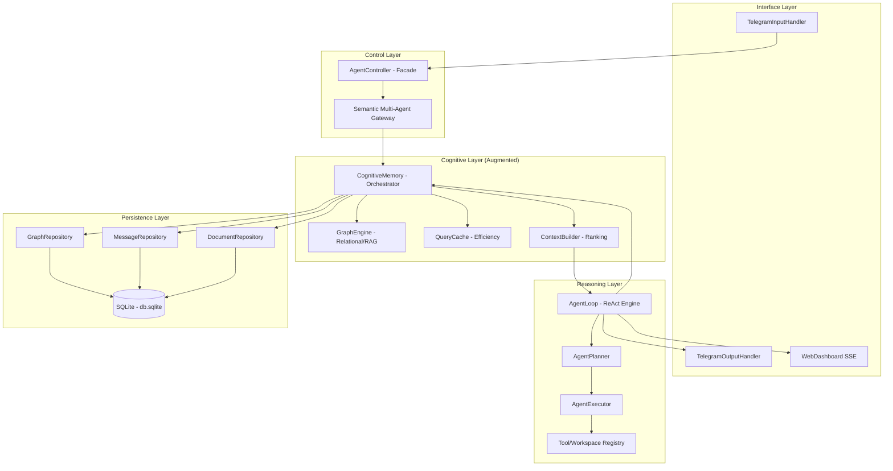
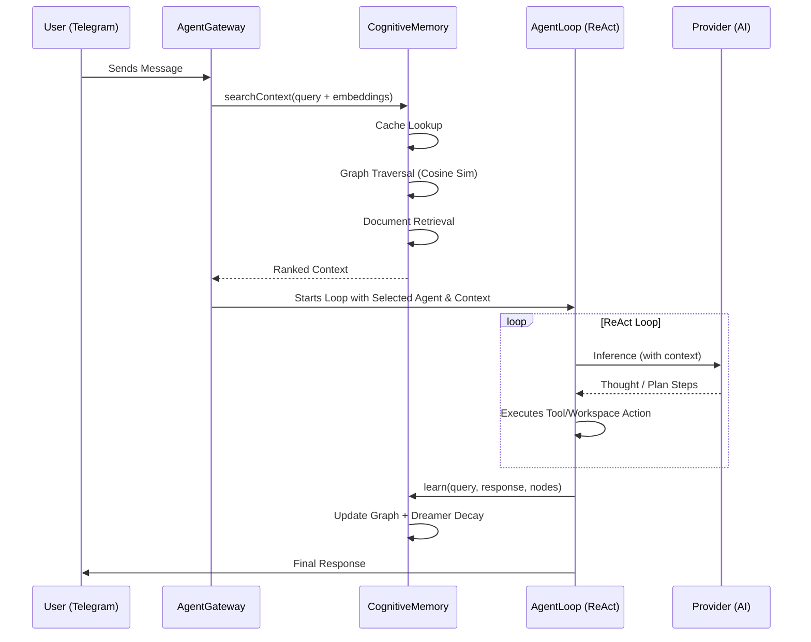
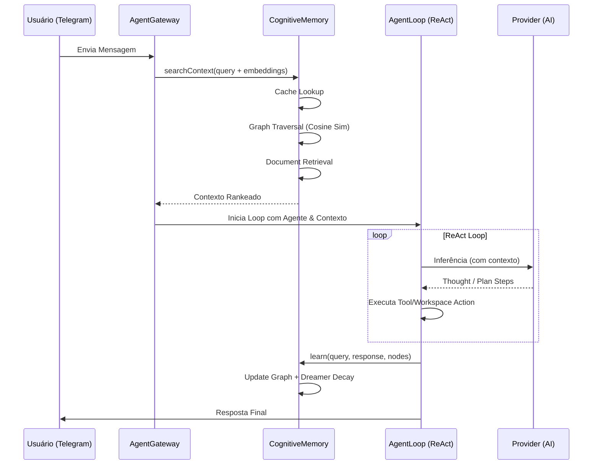

[🇧🇷 Ver versão em Português](#-versão-em-português)

# 🏗️ Project Architecture: IalClaw (Cognitive Version)

**Version:** 3.0  
**Status:** Cognitive Architectural Definition  
**Author:** Luciano + IalClaw Agent  
**Date:** March 24, 2026  

---

## 2.1 Overview

IalClaw has evolved from an automation agent into a **Local Cognitive System**.

The v3.0 architecture focuses on long-term knowledge persistence through an active memory that combines:

* Episodic memory (history)
* Semantic memory (documents + vector embeddings)
* Relational memory (graph)

The system maintains 100% local execution using:

* Telegram as the main interface
* Local Web Dashboard for visualization (`localhost:3000`)
* External/Local LLMs purely for reasoning (Ollama, Gemini, etc.)
* Semantic Multi-Agent Gateway for intent-based routing

With a strict pipeline of **pre-processed context injection** before reasoning.

---

## 2.2 Architectural Requirements (Evolution)

| Requirement | Type | Priority | Notes |
| :--- | :--- | :--- | :--- |
| Active Cognition | Functional | Critical | Retrieve relevant context before each inference |
| Graph Memory | Functional | High | Persist relationships between entities in SQLite |
| Continuous Learning | Functional | High | Update weights and scores after each interaction |
| Cognitive Latency | Non-functional | High | Memory pipeline < 200ms |
| Knowledge Cache | Non-functional | Medium | Avoid redundant calls to the LLM |

---

## 2.3 Architectural Style

We adopt the style:

### Modular Monolith with Decoupled Cognitive Layer

* **Modular Core:** Simplicity in local deployment (pure Node.js/TypeScript)
* **Cognitive Pipeline:** Intelligence middleware between input and reasoning
* **Graph-First Persistence:** Database acts as a knowledge map
* **Semantic Gateway:** Routes intelligently between specialized agents

---

## 2.4 Component and Layer Diagram

---

## 2.5 Cognitive Pipeline (Sequence Diagram)

---

## 2.6 Technology Decisions (v3.0)

| Component | Technology | Details |
| :--- | :--- | :--- |
| Core Engine | Node.js (TypeScript) | Efficient IO, OOP architecture, 100% unified stack |
| Persistence | SQLite (better-sqlite3) | WAL + high performance |
| Graph | Relational Graph Model | Nodes/Edges tables + Embeddings |
| Web UI | Vanilla JS + Vis.js | Real-time neural graph visualization |
| Ranking | Hybrid Scorer | Cosine Similarity + Graph Score + Recency |

---

## 2.7 Language Strategy

The system embraces a **Unified Architecture**:

### TypeScript (100% Full Stack)

Responsible for:
* AgentLoop (ReAct Planner/Executor)
* Telegram Bot Integrations
* Semantic Gateway & Routing
* Embedded SQLite Graph & Tools
* Web Dashboard serving

*Note: Previous versions mapped some data science aspects to Python, but v3.0 unifies all memory and graph operations natively within the Node environment for easier deployment.*

---

## 2.8 Memory Data Structure

### 2.8.1 Relational Memory (Graph)
* Nodes: entities, documents, concepts (now populated with vector embeddings)
* Edges: relations with dynamic weights

Characteristics:
* Weight increases with usage
* Decays over time (MemoryDreamer)
* Foundation for semantic navigation

### 2.8.2 Semantic Memory
* Local files indexed
* Fragmentation by relevant content
* Intelligent selection via ContextBuilder

---

## 2.9 Performance Strategies
* Semantic Query Cache
* Context Ranking
* Token Limits
* SQLite WAL
* Bounded Graph Traversal

---

## 2.10 Risks and Mitigations (Cognitive)

| Risk | Impact | Mitigation |
| :--- | :--- | :--- |
| Graph Explosion | Medium | MemoryDreamer active pruning & depth limit |
| Context Hallucination | High | ReAct Planner strict validation + relevance filter |
| SQLite Concurrency | Medium | Repository pattern |
| Cognitive Latency | Medium | Cache + proper DB indexes |

---

## 2.11 Future Gaps and Evolution
* Complete Web Chat interface parity with Telegram
* Native multimodal analysis pipelines (Image/Audio directly in memory)
* Agent Swarms (Multiple agents debating natively)

---

## 2.12 Conclusion

The architecture has fully evolved from:

**LLM + Simple History**

To:

**A complete local cognitive system with active memory, visual graph, intent routing, and continuous learning.**

---
---

  

# 🇧🇷 Versão em Português

# 🏗️ Arquitetura do Projeto: IalClaw (Versão Cognitiva)

**Versão:** 3.0  
**Status:** Definição Arquitetural Cognitiva  
**Autor:** Luciano + IalClaw Agent  
**Data:** 24 de março de 2026  

---

## 2.1 Visão Geral

O IalClaw evoluiu de um agente de automação para um **Sistema Cognitivo Local**.

A arquitetura v3.0 foca na persistência de conhecimento a longo prazo através de uma memória ativa que combina:

* Memória episódica (histórico)
* Memória semântica (documentos + embeddings)
* Memória relacional (grafo)

O sistema mantém execução 100% local utilizando:

* Telegram como interface principal
* Dashboard Local Web para visualização (`localhost:3000`)
* LLMs externos/locais apenas para inferência (Ollama, Gemini, etc.)
* Gateway Multi-Agente Semântico para roteamento de intenção

Com um pipeline rigoroso de **injeção de contexto pré-processado** antes do raciocínio.

---

## 2.2 Requisitos Arquiteturais (Evolução)

| Requisito | Tipo | Prioridade | Notas |
| :--- | :--- | :--- | :--- |
| Cognição Ativa | Funcional | Crítica | Recuperar contexto relevante antes de cada inferência |
| Memória de Grafo | Funcional | Alta | Persistir relações entre entidades em SQLite |
| Aprendizado Contínuo | Funcional | Alta | Atualizar pesos e scores após cada interação |
| Latência Cognitiva | Não-funcional | Alta | Pipeline de memória < 200ms |
| Cache de Conhecimento | Não-funcional | Média | Evitar chamadas redundantes ao LLM |

---

## 2.3 Estilo Arquitetural

Adotamos o estilo:

### Monolito Modular com Camada Cognitiva Desacoplada

* **Core Modular:** Simplicidade de deploy local (Nativo Node.js/TypeScript)
* **Cognitive Pipeline:** Middleware de inteligência entre input e raciocínio
* **Graph-First Persistence:** Banco atua como mapa de conhecimento
* **Gateway Semântico:** Roteia inteligentemente entre agentes especializados

---

## 2.4 Diagrama de Componentes e Camadas

---

## 2.5 Pipeline Cognitivo (Sequence Diagram)

---

## 2.6 Decisões de Tecnologia (v3.0)

| Componente | Tecnologia | Detalhes |
| :--- | :--- | :--- |
| Core Engine | Node.js (TypeScript) | IO eficiente, arquitetura POO, 100% stack unificada |
| Persistência | SQLite (better-sqlite3) | WAL + alta performance |
| Grafo | Relational Graph Model | Tabelas nodes/edges + Embeddings |
| Web UI | Vanilla JS + Vis.js | Real-time neural graph visualization |
| Ranking | Hybrid Scorer | Similaridade Cosseno + Graph Score + Recency |

---

## 2.7 Estratégia de Linguagens

O sistema adota uma **Arquitetura Unificada**:

### TypeScript (100% Full Stack)

Responsável por:
* AgentLoop (ReAct Planner/Executor)
* Bot Telegram Central
* Semântica e Roteamento via Gateway
* Execução e Persistência do Grafo SQLite
* Dashboard local

*Nota: Versões anteriores delegavam partes estruturais para Python, contudo a v3.0 unifica todos os recursos de memória nativamente no ambiente Node para padronização de build/deploy.*

---

## 2.8 Estrutura de Dados da Memória

### 2.8.1 Memória Relacional (Grafo)
* Nodes: entidades, documentos, conceitos (agora com Embeddings vetoriais)
* Edges: relações com pesos dinâmicos

Características:
* Peso aumenta com uso
* Sofre decaimento limpo na ociosidade (MemoryDreamer)
* Base para navegação semântica

### 2.8.2 Memória Semântica
* Arquivos indexados
* Fragmentação por conteúdo relevante
* Seleção via ContextBuilder

---

## 2.9 Estratégias de Performance
* Semantic Query Cache
* Ranking de contexto
* Limite de tokens
* WAL no SQLite
* Bounded Graph Traversal

---

## 2.10 Riscos e Mitigações (Cognitivos)

| Risco | Impacto | Mitigação |
| :--- | :--- | :--- |
| Explosão do Grafo | Médio | Poda automática pelo MemoryDreamer + limite de profundidade |
| Alucinação de Contexto | Alto | Validador do ReAct + Filtro de relevância |
| Concorrência SQLite | Médio | Repository pattern |
| Latência Cognitiva | Médio | Cache + índices corretos |

---

## 2.11 Gaps e Evolução Futura
* Paridade total da interface Web com o chat do Telegram
* Pipelines nativos modais (Ler imagem diretamente pela memória)
* Swarming nativo (múltiplos agentes argumentativando em background)

---

## 2.12 Conclusão

A arquitetura evoluiu completamente de:

**LLM + histórico simples**

para:

**Um sistema cognitivo local completo, com memória ativa, percepção semântica, roteamento de intenção e aprendizado contínuo.**
