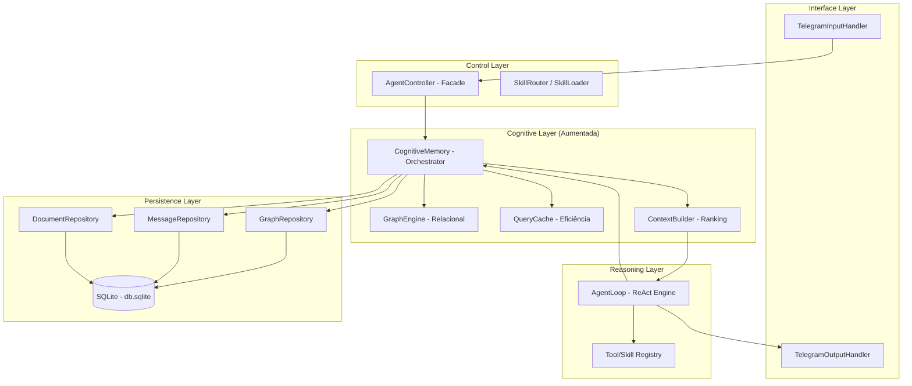
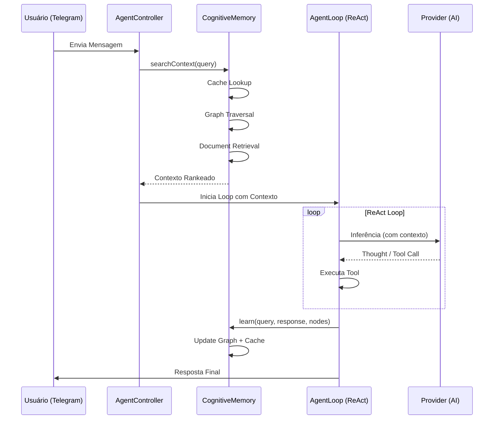

# 🏗️ Arquitetura do Projeto: IalClaw (Versão Cognitiva)

**Versão:** 2.0
**Status:** Definição Arquitetural Cognitiva
**Autor:** Luciano + IalClaw Agent
**Data:** 23 de março de 2026

---

# 2.1 Visão Geral

O IalClaw evoluiu de um agente de automação para um **Sistema Cognitivo Local**.

A arquitetura v2.0 foca na persistência de conhecimento a longo prazo através de uma memória ativa que combina:

* Memória episódica (histórico)
* Memória semântica (documentos)
* Memória relacional (grafo)

O sistema mantém execução 100% local no Windows, utilizando:

* Telegram como interface principal
* LLMs externos apenas para inferência

Com um pipeline rigoroso de **injeção de contexto pré-processado** antes do raciocínio.

---

# 2.2 Requisitos Arquiteturais (Evolução)

| Requisito             | Tipo          | Prioridade | Notas                                                 |
| --------------------- | ------------- | ---------- | ----------------------------------------------------- |
| Cognição Ativa        | Funcional     | Crítica    | Recuperar contexto relevante antes de cada inferência |
| Memória de Grafo      | Funcional     | Alta       | Persistir relações entre entidades em SQLite          |
| Aprendizado Contínuo  | Funcional     | Alta       | Atualizar pesos e scores após cada interação          |
| Latência Cognitiva    | Não-funcional | Alta       | Pipeline de memória < 200ms                           |
| Cache de Conhecimento | Não-funcional | Média      | Evitar chamadas redundantes ao LLM                    |

---

# 2.3 Estilo Arquitetural

Adotamos o estilo:

## Monolito Modular com Camada Cognitiva Desacoplada

* **Core Modular:** Simplicidade de deploy local
* **Cognitive Pipeline:** Middleware de inteligência entre input e raciocínio
* **Graph-First Persistence:** Banco atua como mapa de conhecimento

---

# 2.4 Diagrama de Componentes e Camadas

---

# 2.5 Pipeline Cognitivo (Sequence Diagram)

---

# 2.6 Decisões de Tecnologia (v2.0)

| Componente    | Tecnologia              | Detalhes                      |
| ------------- | ----------------------- | ----------------------------- |
| Core Engine   | Node.js (TypeScript)    | IO eficiente, arquitetura POO |
| Persistência  | SQLite (better-sqlite3) | WAL + alta performance        |
| Grafo         | Relational Graph Model  | Tabelas nodes/edges           |
| Voz (STT/TTS) | Whisper / Edge-TTS      | Multimodal local              |
| Ranking       | Custom Scorer           | Recency + Frequency + Graph   |

---

# 2.7 Estratégia de Linguagens

O sistema adota arquitetura híbrida:

## TypeScript (Core do Agente)

Responsável por:

* AgentLoop (ReAct)
* Telegram Bot
* Orquestração geral
* Execução de Tools

## Python (Infra Cognitiva)

Responsável por:

* Indexação de documentos
* Construção do grafo
* Scripts de manutenção
* Processamento de dados

## Integração

* Banco SQLite compartilhado
* Comunicação indireta via persistência
* Baixo acoplamento

---

# 2.8 Estrutura de Dados da Memória

---

## 2.8.1 Memória Relacional (Grafo)

* Nodes: entidades, documentos, conceitos
* Edges: relações com pesos dinâmicos

Características:

* Peso aumenta com uso
* Base para navegação semântica

---

## 2.8.2 Memória Semântica

* Arquivos `.md` indexados
* Fragmentação por conteúdo relevante
* Seleção inteligente via ContextBuilder

---

# 2.9 Estratégias de Performance

* Query Cache
* Ranking de contexto
* Limite de tokens
* WAL no SQLite
* Travessia limitada do grafo (depth control)

---

# 2.10 Riscos e Mitigações (Cognitivos)

| Risco                  | Impacto | Mitigação                        |
| ---------------------- | ------- | -------------------------------- |
| Explosão do Grafo      | Médio   | Limite de profundidade           |
| Alucinação de Contexto | Alto    | Filtro de relevância + freshness |
| Concorrência SQLite    | Médio   | Repository pattern               |
| Latência Cognitiva     | Médio   | Cache + índices                  |

---

# 2.11 Gaps e Evolução Futura

* Embeddings locais (busca vetorial)
* Hybrid Search (grafo + vetor)
* Auto-linking semântico
* Visualização do grafo (Gephi / JSON export)
* Clustering de conhecimento

---

# 2.12 Conclusão

A arquitetura evolui de:

**LLM + histórico**

para:

**Sistema cognitivo completo com memória ativa, grafo e aprendizado contínuo**
