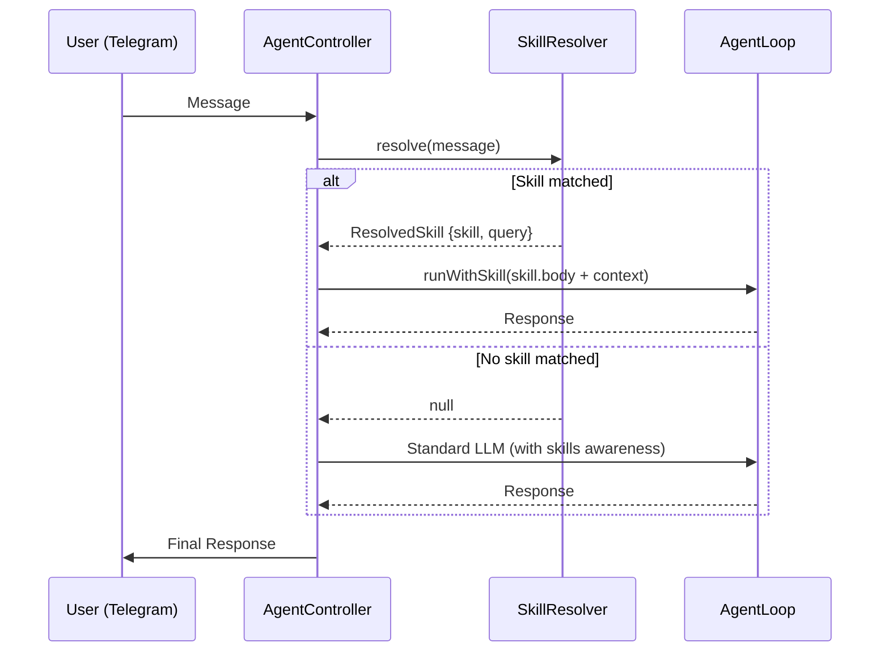
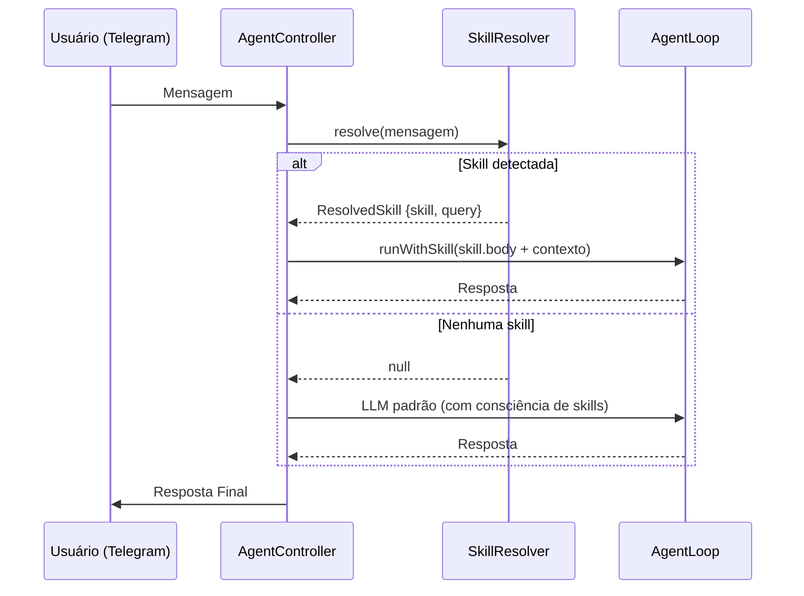

[🇧🇷 Ver versão em Português](#-versão-em-português)

# 🧩 Spec: Skills System — IalClaw

**Version:** 1.0  
**Status:** Active  
**Author:** Luciano + IalClaw Agent  
**Date:** March 26, 2026  

---

## 1. Overview

The Skills System allows IalClaw to dynamically extend its capabilities through content-based instruction packages. Each skill is a self-contained unit with a `SKILL.md` (instructions in frontmatter + Markdown body) and an optional `skill.json` (metadata, triggers, pipeline configuration).

Skills are resolved **before** the LLM is invoked — if a skill matches the user's input, its instructions are injected as the system prompt, replacing the default agent behavior for that interaction.

---

## 2. Architecture

```
┌──────────────────────────────────────────────────────────────┐
│                     AgentController                          │
│                                                              │
│  1. User message arrives                                     │
│  2. SkillResolver.resolve(input) → ResolvedSkill | null      │
│  3a. If resolved → runWithSkill() (skill prompt + tools)     │
│  3b. If null → standard LLM pipeline with skill awareness    │
└──────────────────────────────────────────────────────────────┘

┌───────────────┐     ┌──────────────────┐     ┌─────────────┐
│  SkillLoader  │────▶│  SkillResolver   │────▶│ AgentController│
│  (boot scan)  │     │  (intent match)  │     │  (routing)   │
└───────┬───────┘     └──────────────────┘     └─────────────┘
        │
        ▼
┌──────────────────────────────────────────────┐
│           skills/ directory                   │
│  ├── internal/   (trusted, no audit)          │
│  ├── public/     (third-party, audited)       │
│  └── quarantine/ (blocked, never loaded)      │
└──────────────────────────────────────────────┘
```

### Key Components

| Component | File | Responsibility |
|:---|:---|:---|
| **SkillLoader** | `src/skills/SkillLoader.ts` | Scans `skills/` directories at boot, parses `SKILL.md` frontmatter, loads triggers from `skill.json`, enforces audit rules for public skills |
| **SkillResolver** | `src/skills/SkillResolver.ts` | Matches user input to a loaded skill via 3 strategies (slash command, name mention, freeText triggers) |
| **AuditLog** | `src/skills/AuditLog.ts` | Reads the audit log (JSON Lines) written by `skill-auditor` to determine if a public skill is activatable |
| **LoadedSkill** | `src/skills/types.ts` | Type definition for a loaded skill (name, description, body, origin, triggers, etc.) |
| **AgentController** | `src/core/AgentController.ts` | Routes resolved skills to `runWithSkill()` or injects skill awareness into the standard LLM prompt |

---

## 3. Skill Structure

### 3.1 SKILL.md (Required)

Every skill must have a `SKILL.md` file with YAML frontmatter:

```markdown
---
name: my-skill
description: >
  Brief description of what this skill does.
argument-hint: '<argument description>'
---

## Instructions for the LLM

Step-by-step instructions the agent must follow when this skill is activated.
```

**Frontmatter Fields:**

| Field | Required | Description |
|:---|:---|:---|
| `name` | Yes | Canonical slug used for slash commands (`/my-skill`) and matching |
| `description` | Yes | Brief description for intent detection and LLM context injection |
| `argument-hint` | No | Displayed when user invokes the skill without arguments |

### 3.2 skill.json (Optional)

Provides additional metadata and invocation configuration:

```json
{
  "name": "skill-installer",
  "kind": "internal",
  "trusted": true,
  "version": "1.0.0",
  "entry": "SKILL.md",
  "invocation": {
    "slashCommands": ["/install-skill <tema>", "/find-skill <tema>"],
    "freeText": [
      "instalar skill",
      "baixar skill",
      "skills disponíveis",
      "procure uma skill"
    ]
  },
  "requiredTools": ["fetch_url", "write_skill_file", "web_search"]
}
```

**Key Fields:**

| Field | Description |
|:---|:---|
| `kind` | `"internal"` or omitted. Internal skills skip audit requirements |
| `trusted` | Marks the skill as trusted (internal only) |
| `invocation.slashCommands` | Alternative slash commands |
| `invocation.freeText` | Array of trigger phrases for natural language activation |
| `requiredTools` | Tools the skill needs to function |

---

## 4. Directory Layout & Trust Model

```
skills/
  internal/          ← Trusted skills (no audit required)
    skill-auditor/   ← Security auditor for public skills
    skill-installer/ ← Marketplace search & install
  public/            ← Third-party skills (audit required)
  quarantine/        ← Blocked skills (never loaded)
```

### Trust Levels

| Origin | Audit Required | Loaded At Boot |
|:---|:---|:---|
| `internal/` | No | Always |
| `public/` (approved) | Yes — `approved` or `approved_with_restrictions` | Yes |
| `public/` (not audited) | — | No (warning logged) |
| `quarantine/` | — | Never |

### Audit Flow

1. User installs a skill to `skills/public/<name>/`
2. User runs `/skill-auditor <name>` via Telegram
3. The auditor analyzes the skill files and produces a decision
4. Decision is appended to the audit log (`data/skill-audit-log.json`) as JSON Lines
5. On next boot (or hot-reload), `SkillLoader` reads the audit log via `AuditLog.isActivatable()`

**Audit Statuses:**

| Status | Effect |
|:---|:---|
| `approved` | Skill is loaded and active |
| `approved_with_restrictions` | Skill is loaded and active (with noted caveats) |
| `manual_review` | Skill is NOT loaded (requires human review) |
| `quarantined` | Skill is NOT loaded (moved to quarantine) |
| `blocked` | Skill is NOT loaded |

---

## 5. Resolution Pipeline

When a user message arrives, `SkillResolver.resolve()` applies three strategies in order of priority:

### Strategy 1: Slash Command
```
/skill-name [arguments]
```
The prefix after `/` is matched against loaded skill names (case-insensitive). Arguments are extracted and passed as the clean query.

### Strategy 2: Name Mention
The full user text is scanned for any loaded skill name (case-insensitive substring match).

### Strategy 3: FreeText Triggers
Each skill's `triggers[]` array (from `skill.json → invocation.freeText`) is checked against the user text (case-insensitive substring match).

If **any** strategy matches, the skill is activated and the message is routed to `runWithSkill()` instead of the standard LLM pipeline.

---

## 6. Execution: runWithSkill()

When a skill is resolved, `AgentController.runWithSkill()` executes the following:

1. **Memory Retrieval** — Embeds the original query, retrieves relevant memory nodes via `CognitiveMemory.retrieveWithTraversal()`
2. **Context Building** — Builds context string from identity nodes + memory nodes
3. **Path Adaptation** — Replaces OpenClaw-style paths (`.agent/skills/`) with IalClaw workspace paths (`workspace/skills/`)
4. **System Prompt** — Injects the skill body + context as the system prompt:
   ```
   Voce e o IalClaw, um agente cognitivo 100% local e privado.
   A skill abaixo foi ativada pelo usuario. Siga suas instrucoes rigorosamente.
   
   ## Skill ativa: <name>
   
   <skill body>
   
   <context>
   ```
5. **Execution** — Runs the `AgentLoop` with elevated limits (`max_steps: 10`, `max_tool_calls: 12`)
6. **Learning** — Saves the interaction to memory and triggers the learning cycle

---

## 7. Skill Awareness (LLM Context Injection)

Even when **no skill is resolved**, the agent is aware of all installed skills. The standard LLM prompt includes:

```
CAPACIDADES DO AGENTE (skills instaladas):
- skill-auditor: <description>
- skill-installer: <description>

Se uma tarefa puder ser resolvida com uma dessas skills, considere que voce TEM essa capacidade.
Nunca diga que nao possui ferramentas sem considerar essas skills.
Se nenhuma skill instalada resolver a tarefa, voce pode sugerir buscar ou instalar uma nova skill.
Use /install-skill ou /find-skill para buscar novas skills.
```

This enables the agent to:
- Recommend existing skills to the user
- Suggest installing new skills when no current skill fits

---

## 8. Built-in Skills

### 8.1 skill-auditor (Internal)
- **Purpose:** Analyzes public skill files for security risks
- **Invocation:** `/skill-auditor <name>`
- **Output:** Writes audit decision to `data/skill-audit-log.json`
- **Decisions:** `approved`, `approved_with_restrictions`, `manual_review`, `quarantined`, `blocked`

### 8.2 skill-installer (Internal)
- **Purpose:** Searches the skills marketplace and installs new skills
- **Invocation:** `/install-skill <tema>`, `/find-skill <tema>`, or natural language triggers
- **Marketplace:** `https://skills.sh/`
- **Pipeline:** Search → Download → Write to `skills/public/` → Run auditor → Reload

---

## 9. Lifecycle



---

## 10. Creating a New Skill

1. Create directory: `skills/internal/<name>/` or `skills/public/<name>/`
2. Create `SKILL.md` with frontmatter (`name`, `description`) and instruction body
3. Optionally create `skill.json` with `invocation.freeText` triggers and metadata
4. For public skills: run `/skill-auditor <name>` to audit
5. Restart the agent or trigger hot-reload — `SkillLoader.load()` will pick it up

---
---

<br><br>

# 🇧🇷 Versão em Português

# 🧩 Spec: Sistema de Skills — IalClaw

**Versão:** 1.0  
**Status:** Ativo  
**Autor:** Luciano + IalClaw Agent  
**Data:** 26 de março de 2026  

---

## 1. Visão Geral

O Sistema de Skills permite que o IalClaw estenda suas capacidades dinamicamente através de pacotes de instrução baseados em conteúdo. Cada skill é uma unidade autocontida com um `SKILL.md` (instruções em frontmatter + corpo Markdown) e um `skill.json` opcional (metadados, triggers, configuração de pipeline).

As skills são resolvidas **antes** da chamada ao LLM — se uma skill corresponder à entrada do usuário, suas instruções são injetadas como system prompt, substituindo o comportamento padrão do agente para aquela interação.

---

## 2. Arquitetura

```
┌──────────────────────────────────────────────────────────────┐
│                     AgentController                          │
│                                                              │
│  1. Mensagem do usuário chega                                │
│  2. SkillResolver.resolve(input) → ResolvedSkill | null      │
│  3a. Se resolvida → runWithSkill() (prompt da skill + tools) │
│  3b. Se null → pipeline LLM padrão com consciência de skills │
└──────────────────────────────────────────────────────────────┘

┌───────────────┐     ┌──────────────────┐     ┌────────────────┐
│  SkillLoader  │────▶│  SkillResolver   │────▶│ AgentController│
│  (scan boot)  │     │  (detec. intent) │     │  (roteamento)  │
└───────┬───────┘     └──────────────────┘     └────────────────┘
        │
        ▼
┌──────────────────────────────────────────────┐
│           diretório skills/                   │
│  ├── internal/   (confiáveis, sem auditoria)  │
│  ├── public/     (terceiros, auditadas)       │
│  └── quarantine/ (bloqueadas, nunca carregam) │
└──────────────────────────────────────────────┘
```

### Componentes Principais

| Componente | Arquivo | Responsabilidade |
|:---|:---|:---|
| **SkillLoader** | `src/skills/SkillLoader.ts` | Varre `skills/` no boot, parseia frontmatter do `SKILL.md`, carrega triggers do `skill.json`, aplica regras de auditoria para skills públicas |
| **SkillResolver** | `src/skills/SkillResolver.ts` | Detecta qual skill ativar via 3 estratégias (slash command, menção ao nome, triggers freeText) |
| **AuditLog** | `src/skills/AuditLog.ts` | Lê o log de auditoria (JSON Lines) escrito pelo `skill-auditor` para verificar se uma skill pública é ativável |
| **LoadedSkill** | `src/skills/types.ts` | Definição de tipo para uma skill carregada (name, description, body, origin, triggers, etc.) |
| **AgentController** | `src/core/AgentController.ts` | Roteia skills resolvidas para `runWithSkill()` ou injeta consciência de skills no prompt LLM padrão |

---

## 3. Estrutura de uma Skill

### 3.1 SKILL.md (Obrigatório)

Toda skill deve ter um `SKILL.md` com frontmatter YAML:

```markdown
---
name: minha-skill
description: >
  Descrição breve do que essa skill faz.
argument-hint: '<descrição do argumento>'
---

## Instruções para o LLM

Passo a passo que o agente deve seguir quando esta skill for ativada.
```

**Campos do Frontmatter:**

| Campo | Obrigatório | Descrição |
|:---|:---|:---|
| `name` | Sim | Slug canônico usado para slash commands (`/minha-skill`) e detecção |
| `description` | Sim | Descrição breve para detecção de intenção e injeção no contexto LLM |
| `argument-hint` | Não | Exibido quando o usuário invoca a skill sem argumentos |

### 3.2 skill.json (Opcional)

Metadados adicionais e configuração de invocação:

```json
{
  "name": "skill-installer",
  "kind": "internal",
  "trusted": true,
  "version": "1.0.0",
  "entry": "SKILL.md",
  "invocation": {
    "slashCommands": ["/install-skill <tema>", "/find-skill <tema>"],
    "freeText": [
      "instalar skill",
      "baixar skill",
      "skills disponíveis",
      "procure uma skill"
    ]
  },
  "requiredTools": ["fetch_url", "write_skill_file", "web_search"]
}
```

**Campos Principais:**

| Campo | Descrição |
|:---|:---|
| `kind` | `"internal"` ou omitido. Skills internas não precisam de auditoria |
| `trusted` | Marca a skill como confiável (somente internas) |
| `invocation.freeText` | Array de frases gatilho para ativação por linguagem natural |
| `requiredTools` | Tools que a skill precisa para funcionar |

---

## 4. Layout de Diretórios & Modelo de Confiança

```
skills/
  internal/          ← Skills confiáveis (sem auditoria)
    skill-auditor/   ← Auditor de segurança para skills públicas
    skill-installer/ ← Busca e instalação do marketplace
  public/            ← Skills de terceiros (auditoria obrigatória)
  quarantine/        ← Skills bloqueadas (nunca carregadas)
```

### Níveis de Confiança

| Origem | Auditoria Necessária | Carregada no Boot |
|:---|:---|:---|
| `internal/` | Não | Sempre |
| `public/` (aprovada) | Sim — `approved` ou `approved_with_restrictions` | Sim |
| `public/` (não auditada) | — | Não (warning registrado) |
| `quarantine/` | — | Nunca |

### Fluxo de Auditoria

1. Usuário instala uma skill em `skills/public/<nome>/`
2. Usuário executa `/skill-auditor <nome>` via Telegram
3. O auditor analisa os arquivos da skill e produz uma decisão
4. A decisão é gravada no log de auditoria (`data/skill-audit-log.json`) como JSON Lines
5. No próximo boot (ou hot-reload), `SkillLoader` lê o log via `AuditLog.isActivatable()`

**Status de Auditoria:**

| Status | Efeito |
|:---|:---|
| `approved` | Skill carregada e ativa |
| `approved_with_restrictions` | Skill carregada e ativa (com ressalvas documentadas) |
| `manual_review` | Skill NÃO carregada (requer revisão humana) |
| `quarantined` | Skill NÃO carregada (movida para quarentena) |
| `blocked` | Skill NÃO carregada |

---

## 5. Pipeline de Resolução

Quando uma mensagem do usuário chega, `SkillResolver.resolve()` aplica três estratégias em ordem de prioridade:

### Estratégia 1: Slash Command
```
/nome-da-skill [argumentos]
```
O prefixo após `/` é comparado com os nomes das skills carregadas (case-insensitive). Argumentos são extraídos e passados como query limpa.

### Estratégia 2: Menção ao Nome
O texto completo do usuário é varrido buscando qualquer nome de skill carregada (substring case-insensitive).

### Estratégia 3: FreeText Triggers
O array `triggers[]` de cada skill (de `skill.json → invocation.freeText`) é verificado contra o texto do usuário (substring case-insensitive).

Se **qualquer** estratégia casar, a skill é ativada e a mensagem é roteada para `runWithSkill()` em vez do pipeline LLM padrão.

---

## 6. Execução: runWithSkill()

Quando uma skill é resolvida, `AgentController.runWithSkill()` executa:

1. **Recuperação de Memória** — Embeda a query original, recupera nós relevantes via `CognitiveMemory.retrieveWithTraversal()`
2. **Construção de Contexto** — Monta string de contexto a partir de nós de identidade + memória
3. **Adaptação de Caminhos** — Substitui caminhos estilo OpenClaw (`.agent/skills/`) para caminhos do workspace IalClaw (`workspace/skills/`)
4. **System Prompt** — Injeta corpo da skill + contexto como system prompt:
   ```
   Voce e o IalClaw, um agente cognitivo 100% local e privado.
   A skill abaixo foi ativada pelo usuario. Siga suas instrucoes rigorosamente.
   
   ## Skill ativa: <nome>
   
   <corpo da skill>
   
   <contexto>
   ```
5. **Execução** — Roda o `AgentLoop` com limites elevados (`max_steps: 10`, `max_tool_calls: 12`)
6. **Aprendizado** — Salva a interação na memória e dispara o ciclo de aprendizado

---

## 7. Consciência de Skills (Injeção no Contexto LLM)

Mesmo quando **nenhuma skill é resolvida**, o agente conhece todas as skills instaladas. O prompt LLM padrão inclui:

```
CAPACIDADES DO AGENTE (skills instaladas):
- skill-auditor: <descrição>
- skill-installer: <descrição>

Se uma tarefa puder ser resolvida com uma dessas skills, considere que voce TEM essa capacidade.
Nunca diga que nao possui ferramentas sem considerar essas skills.
Se nenhuma skill instalada resolver a tarefa, voce pode sugerir buscar ou instalar uma nova skill.
Use /install-skill ou /find-skill para buscar novas skills.
```

Isto permite ao agente:
- Recomendar skills existentes ao usuário
- Sugerir a instalação de novas skills quando nenhuma skill atual é adequada

---

## 8. Skills Nativas

### 8.1 skill-auditor (Interna)
- **Propósito:** Analisa arquivos de skills públicas em busca de riscos de segurança
- **Invocação:** `/skill-auditor <nome>`
- **Saída:** Escreve decisão de auditoria em `data/skill-audit-log.json`
- **Decisões:** `approved`, `approved_with_restrictions`, `manual_review`, `quarantined`, `blocked`

### 8.2 skill-installer (Interna)
- **Propósito:** Busca no marketplace de skills e instala novas skills
- **Invocação:** `/install-skill <tema>`, `/find-skill <tema>`, ou triggers de linguagem natural
- **Marketplace:** `https://skills.sh/`
- **Pipeline:** Busca → Download → Escrita em `skills/public/` → Execução do auditor → Reload

---

## 9. Ciclo de Vida



---

## 10. Criando uma Nova Skill

1. Criar diretório: `skills/internal/<nome>/` ou `skills/public/<nome>/`
2. Criar `SKILL.md` com frontmatter (`name`, `description`) e corpo de instruções
3. Opcionalmente criar `skill.json` com triggers `invocation.freeText` e metadados
4. Para skills públicas: executar `/skill-auditor <nome>` para auditar
5. Reiniciar o agente ou disparar hot-reload — `SkillLoader.load()` carregará automaticamente
